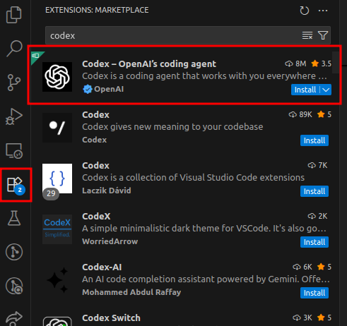
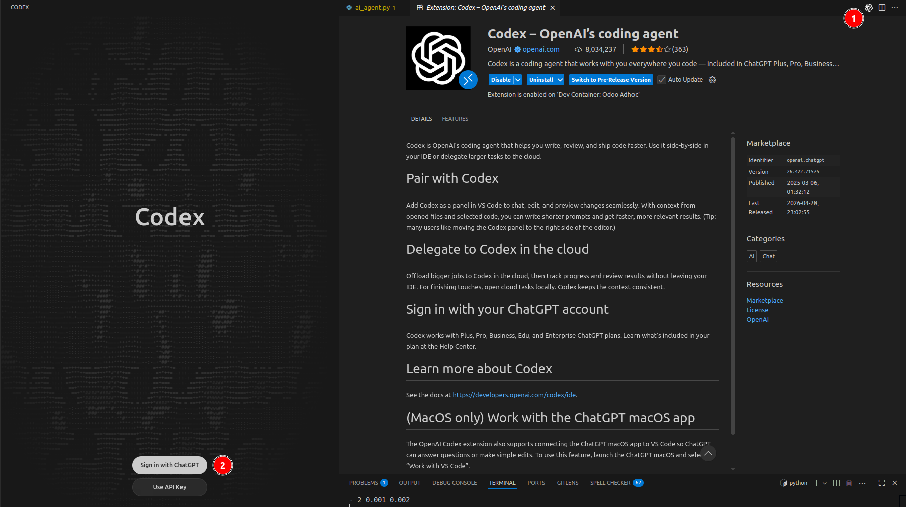
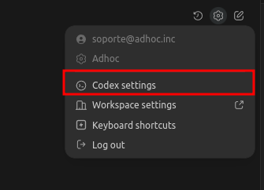
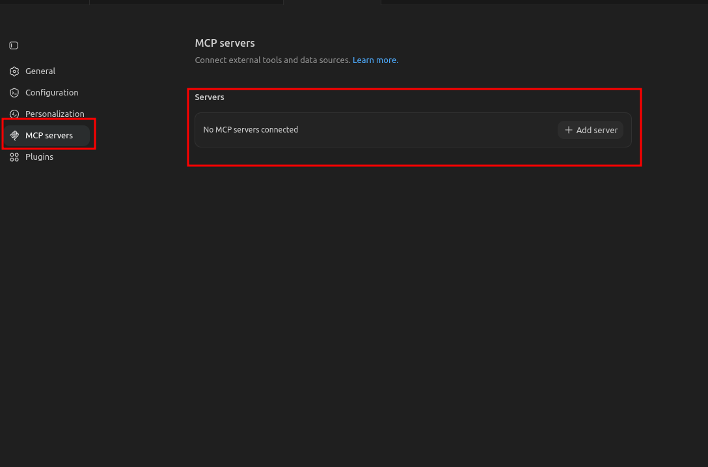
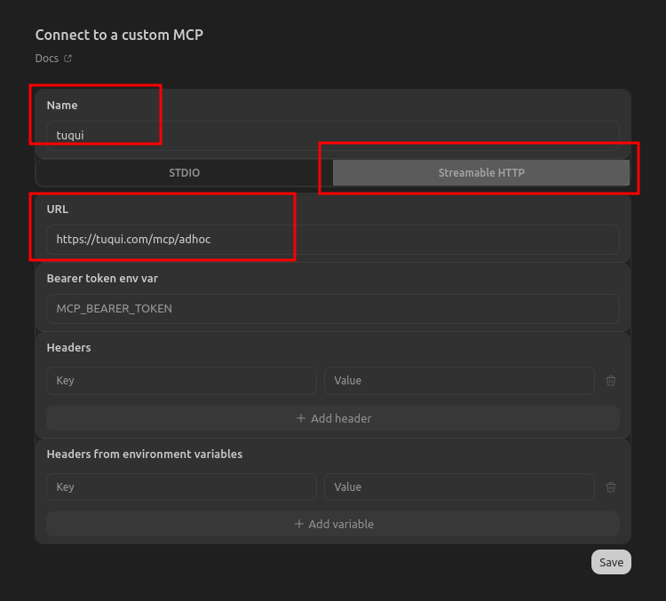
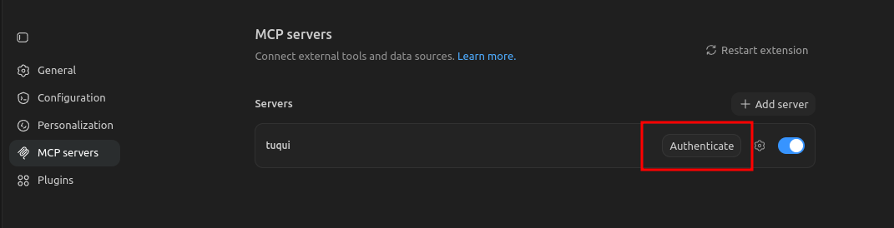
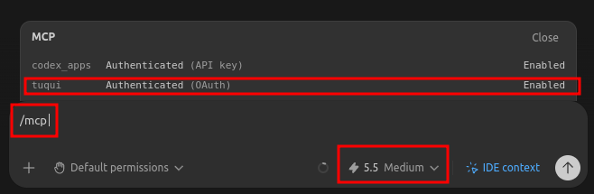

# Boost con IA

Repositorio para una capacitación de Boost con IA orientada a trabajo asistido con agentes sobre datos de Odoo usando Tuqui MCP.

## Objetivo

El ejercicio consiste en analizar información de Odoo de Adhoc para detectar oportunidades de mejora en los productos del equipo y convertir ese análisis en propuestas accionables.

## Herramientas esperadas

- Codex (extensión de VS Code para POs, CLI para devs)
- Tuqui MCP
- Skills de apoyo cuando apliquen, por ejemplo para commits

## Clonar el repo

- **POs** (via HTTPS):

  ```bash
  git clone https://github.com/adhoc-dev/boost-con-ia.git
  ```

- **Devs** (via SSH):

  ```bash
  git clone git@github.com:adhoc-dev/boost-con-ia.git
  ```

Luego entrar al directorio:

```bash
cd boost-con-ia
code .
```

---

## Setup de Codex

Los **POs** usan la extensión de VS Code. Los **devs** pueden usar cualquiera de las dos opciones (extensión o CLI).

### Via extensión

#### 1. Instalar la extensión

En VS Code, abrir la pestaña de **Extensions** y buscar `codex`. Instalar la primera, **Codex – OpenAI's coding agent** (publicada por OpenAI).



#### 2. Iniciar sesión con ChatGPT

Abrir la extensión y elegir **Sign in with ChatGPT**. El login debe hacerse con la cuenta de ChatGPT compartida por el equipo (`team-*@adhoc.inc`), no con cuentas personales.



#### 3. Abrir Codex settings

Desde el ícono de engranaje de la extensión, entrar a **Codex settings**.



#### 4. Agregar Tuqui como MCP server

En la sección **MCP servers** dentro de Codex settings, hacer clic en **+ Add server**.



Completar el formulario con:

- **Name:** `tuqui`
- Tipo: **Streamable HTTP**
- **URL:** `https://tuqui.ai/mcp/adhoc`

Dejar el resto en blanco y guardar.



#### 5. Autenticarse contra Tuqui

El server queda listado pero pide autenticación. Hacer clic en **Authenticate**: se abre Tuqui en el navegador para completar el login. Una vez autenticado, se puede cerrar la pestaña.



#### 6. Verificar y configurar el modelo

De vuelta en el chat de Codex, correr `/mcp` para confirmar que `tuqui` aparece como **Authenticated (OAuth)** y **Enabled**. Desde el selector inferior, elegir el modelo **5.5** con effort **Medium**.



Si en algún momento se cierra la sesión de Tuqui, volver al panel de **MCP servers** y usar **Authenticate** de nuevo.

### Via CLI

Si todavía no tenés Codex instalado, bajarlo via curl (no usar npm):

```bash
curl -fL -o codex.tar.gz https://github.com/openai/codex/releases/latest/download/codex-x86_64-unknown-linux-musl.tar.gz
tar -xzf codex.tar.gz
sudo install -m 0755 codex-x86_64-unknown-linux-musl /usr/local/bin/codex
rm codex.tar.gz codex-x86_64-unknown-linux-musl
```

Levantar Codex desde el repo con:

```bash
codex
```

El login debe hacerse con la cuenta de ChatGPT compartida por el equipo (`team-*@adhoc.inc`), no con cuentas personales.

#### Configurar el modelo

Dentro de Codex, correr `/model` y elegir `gpt-5.5` con effort `medium`.

#### Configurar Tuqui MCP

El registro del MCP se hace **por fuera de Codex**, desde la terminal:

```bash
codex mcp add tuqui --url https://tuqui.ai/mcp/adhoc
```

Esto abre directamente Tuqui en el navegador para autenticarse. Una vez completada la autenticación, se puede cerrar la pestaña y volver a la terminal.

Una vez registrado, volver a entrar a Codex con `codex` y correr `/mcp`. Deberían aparecer las tools correspondientes (`tuqui_context`, `odoo_schema_discover`, `odoo_fields_get`, `odoo_read_group`, `odoo_search_read`, entre otras).

Si en algún momento se cierra la sesión de Tuqui, volver a autenticar desde la terminal con:

```bash
codex mcp login tuqui
```

---

## Enunciado

El flujo simula la colaboración entre PO y devs apoyada por agentes:

1. **PO**: analiza los tickets de los últimos 3 meses sobre los productos `adhoc.product` del equipo vía Tuqui MCP, y redacta specs **funcionales** (sin referencias a código) que apunten a reducir la recurrencia de tickets.
2. **PO**: sube esas specs a una rama y las entrega a los devs (usando Codex + skills).
3. **Devs**: se pasan a la rama y, con la spec funcional, abren el entorno de desarrollo.
4. **Devs**: con la spec funcional y el contexto del código, generan una spec **técnica** de implementación.
5. **Devs**: implementan la spec técnica y abren el PR correspondiente.

### Entregables esperados

- 1 informe breve con evidencia y hallazgos del análisis de tickets
- 2 specs funcionales priorizadas para bajar recurrencia de tickets
- 2 specs técnicas derivadas de las funcionales
- uno o más PRs implementando las specs
